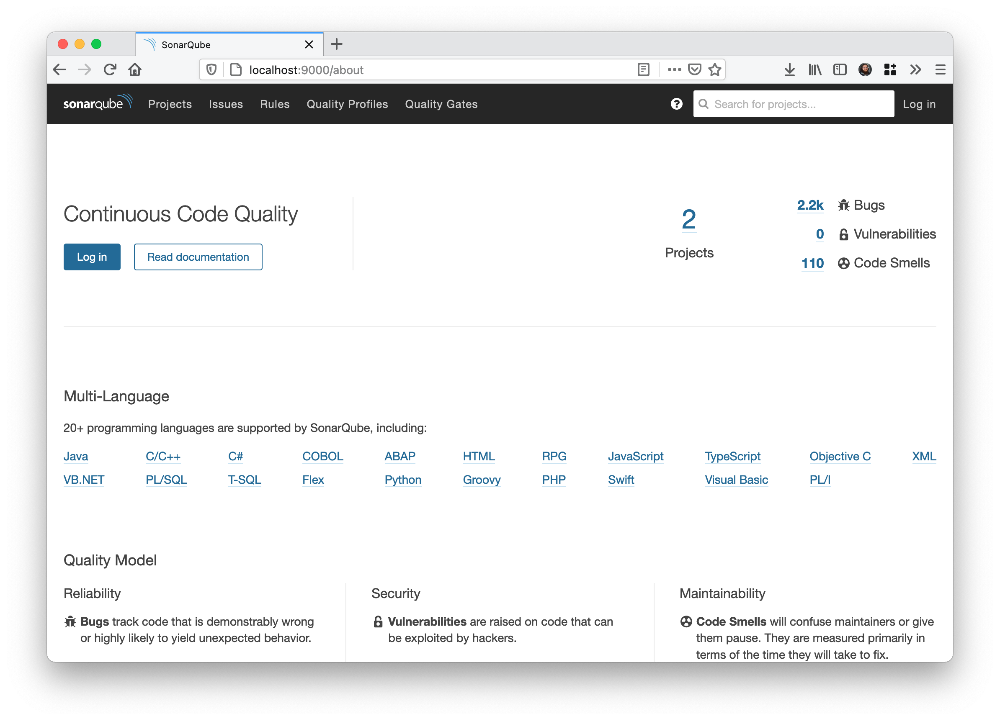

# SonarQube with Docker Compose
Using Docker Compose will create a [SonarQube](https://www.sonarqube.org/) server backed by a PostgreSQL database. All the data will be saved into Docker volumes, ensuring everything is persisted even after the Docker containers are turned off. By using Docker Compose this helps with create a community SonarQube server to let users analyze projects code quality with the minimum numbers of steps needed.

## Prerequisites
Docker and Docker Compose, both of which can be installed with [Docker Desktop](https://www.docker.com/products/docker-desktop) if you are using macOS or Windows 10.

## Commands
* `docker-compose up` - Creates everything based on the `docker-compose.yml`
* `docker-compose stop` - Stops all the services
* `docker-compose down` - Stops and removes all everything, but leave the volumes with all the saved data

### Starting the SonarQube server
Running `docker-compose up` will download all the images and create the needed volumes to store data. The first time doing this will take a bit longer to download and build everything, but this should be much quicker next time. The server will start and running on port 9000 on your localhost. You can change this port in the `docker-compose.yml` file if it conflicts with other services on your system. Open [http://localhost:9000](http://localhost:9000) in your browser to get to the SonarQube home page. The default login for SonarQube is username `admin` and password `admin`.



## Recommendations
I would suggest updating Docker Desktop settings to give more resources to the virtual machine running Docker, for both CPUs and memory.

This can be done under "Preferences" > "Resources" > "Advanced".


## Helpful Alias
To control the SonarQube server quickly, I create some alias in my `~/.zshrc`. If you are using Bash, the equivalent file will be `~/.bashrc`.

```bash
# Export and alias for SonarQube
export SONARQUBE_COMPOSE="<Path to SonarQube Compose>"

alias sonar-start="docker-compose -f $SONARQUBE_COMPOSE/docker-compose.yml up -d"
alias sonar-logs="docker-compose -f $SONARQUBE_COMPOSE/docker-compose.yml logs -f"
alias sonar-stop="docker-compose -f $SONARQUBE_COMPOSE/docker-compose.yml stop"
alias sonar-down="docker-compose -f $SONARQUBE_COMPOSE/docker-compose.yml down"
```

You can get your path by running `pwd` on the terminal in the folder that holds `docker-compose.yml` and then update `SONARQUBE_COMPOSE` with that path.

# Scanning a Project
To scan a project, you need two things to set up the project in SonarQube and have a scanner installed.

You can create a new project from within the SonarQube web UI. This page lets you create a project key and a token that is needed by the scanner.

Based on the type of project, you can sometimes include the scanner as part of the project, you can do this for Java project using [Maven](https://docs.sonarqube.org/latest/analysis/scan/sonarscanner-for-maven/) or [Gradle](https://docs.sonarqube.org/latest/analysis/scan/sonarscanner-for-gradle/), or C# projects using [MSBuild](https://docs.sonarqube.org/latest/analysis/scan/sonarscanner-for-msbuild/).

For other projects, like JavaScript, TypeScript, and PHP, you will need to install the command line scanner tool, which is available for Windows, macOS, and Linux. There is also a [docker image](https://hub.docker.com/r/sonarsource/sonar-scanner-cli) of the scanner available to use for a full Docker setup.

## Properties File
You can create a `sonar-project.properties` in the project folder that will let you change how the scanner runs on your project. These configurations can be useful for excluding certain folders that you do not want to be scanned along with other options. You can even put your `projectKey` and `login` in this file, but I would recommend against that as this may interfere with other people scanning the project with their SonarQube server. More documentation can be found at [SonarScanner page](https://docs.sonarqube.org/latest/analysis/scan/sonarscanner/).

## Installing sonar-scanner with Homebrew
If you are a Homebrew user on macOS, you can easily install the sonar-scanner by running this command, `brew update && brew install sonar-scanner`

As I scan the same project on a regular basis I found that creating an alias is helpful,

```bash
alias sonar-scan-<Project Key>="sonar-scanner \
-Dsonar.projectKey=<Project Key> \
-Dsonar.login=<Generated Token> \
-Dsonar.host.url=http://localhost:9000 \
-Dsonar.projectBaseDir=<Project Path>"
```

## Scanning a project using the sonar-scanner in Docker
Using `sonarsource/sonar-scanner-cli`, you can scan a project by mounting your project folder into the container and connecting to the same network that SonarQube is running in, `sonarqubecompose_sonarqube`.

Here is an example of the Docker command to scan a project,

```bash
docker run --rm \
    -v "<Full Path To Repository>:/usr/src" \
    --network="sonarqubecompose_sonarqube" \
    sonarsource/sonar-scanner-cli \
    -Dsonar.host.url=http://sonarqube:9000 \
    -Dsonar.login=<Generated Token> \
    -Dsonar.projectKey=<Project Key>
```

I have had some issues with scanning large projects using the Docker image, but this could be due to my system configuration. I typically will use a natively installed version of the scanner.

# Contributions are welcome!
See something wrong? Could the documentation be better? Feel free to create a Pull Request for any updates.